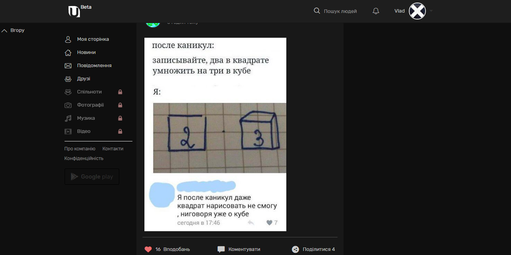

# Dark Style for www.ukrainians.co
Dark Style for site [Ukrainians.co](https://www.ukrainians.co)

Dark theme for the site [Ukrainians.co](https://www.ukrainians.co)
It is not yet over, it's not strictly judged

## Installing

* If you're using a browser extension:
  * Stylus - get the addon for [Firefox](https://addons.mozilla.org/en-US/firefox/addon/styl-us/), [Chrome](https://chrome.google.com/webstore/detail/stylus/clngdbkpkpeebahjckkjfobafhncgmne) and [Opera](https://addons.opera.com/en-gb/extensions/details/stylus/).
  * Stylish - get the addon for [Firefox](https://addons.mozilla.org/en-US/firefox/addon/2108/), [Chrome](https://chrome.google.com/extensions/detail/fjnbnpbmkenffdnngjfgmeleoegfcffe), [Opera](https://addons.opera.com/en/extensions/details/stylish/), [Safari](http://sobolev.us/stylish/) and [Firefox Mobile](https://addons.mozilla.org/en-US/firefox/addon/2108/).
  * Then install this style using:
    * [userstyles.org](https://userstyles.org/styles/146287) (with customization options)
    * or, add it [manually](https://raw.githubusercontent.com/VBIralo/Dark-Style-for-www.ukrainians.co/master/style.css) into the editor.

## Screenshots

    

## Questions

Having any issues file a [GitHub Issue](https://github.com/VBIralo/Dark-Style-for-www.ukrainians.co/issues/new).

## License

This theme is free and open source software, distributed under the The MIT License. So feel free to use this site anyway you want.

## Credits

This site was partially developed with inspiration from this person
- [Vlad Biralo](https://github.com/VBIralo)

